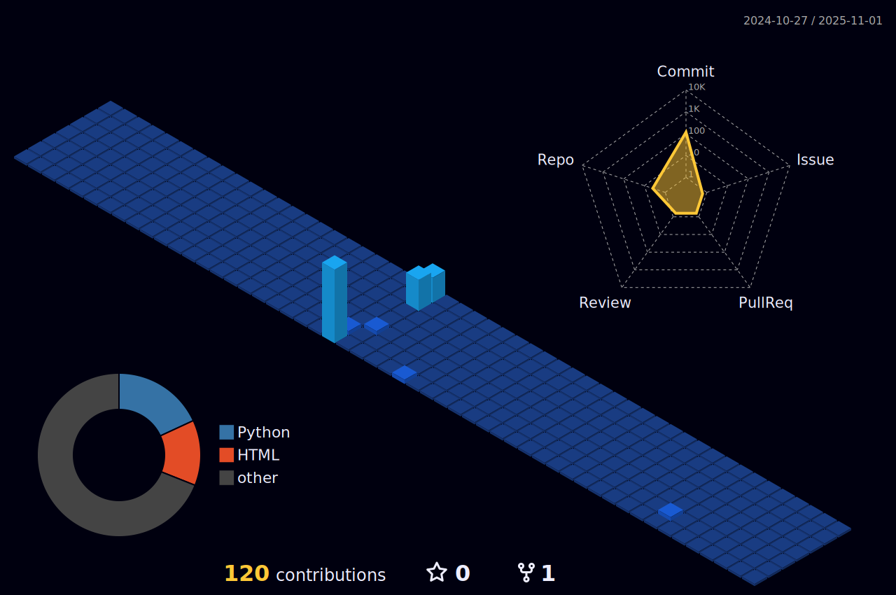

)

###

### 🛠️ Tech Stack

#### Programming Languages

#### Web Development

#### Tools & Platforms

###

### 📊 GitHub Analytics

<!-- Stats Cards -->

<!-- Activity Graph -->

###

### 🏆 Achievements

<!-- Follow Section -->

  

###

<!-- Animated Heart -->

